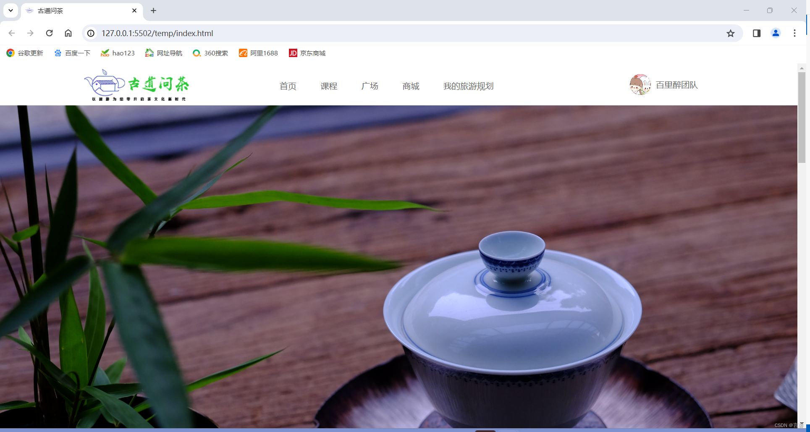
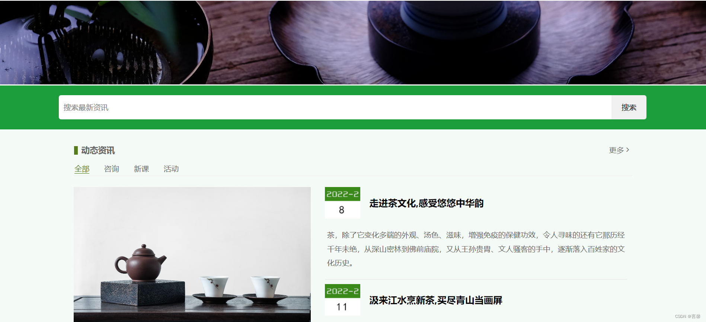
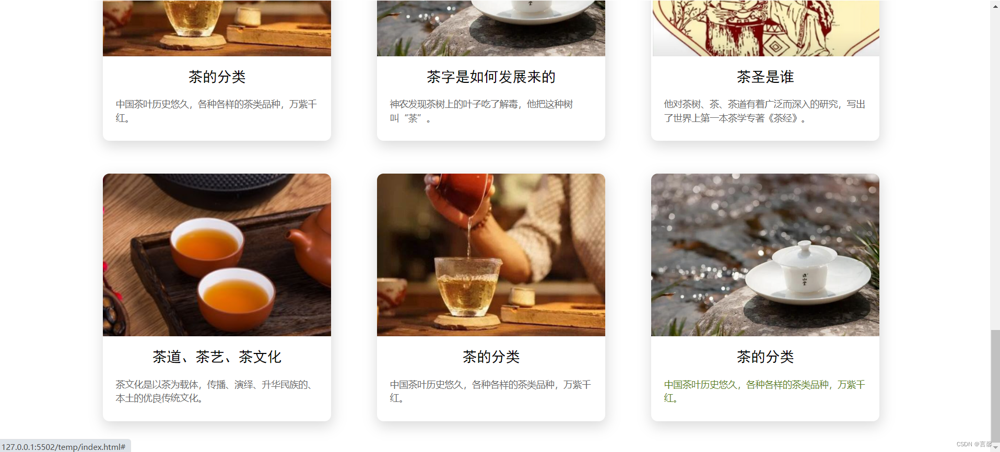

# 古道问茶（Gdwc）

古道问茶是一个以“茶文化传播 + 文旅内容展示”为核心的静态前端项目，通过图文化页面展示茶文化资讯、课程入口、内容广场与旅游规划等模块。

---

## 项目背景

在传统茶文化传播场景中，常见问题包括：

- 内容分散，缺少统一的线上展示入口；
- 年轻用户触达弱，信息呈现形式不够直观；
- 文旅与茶文化联动不足，缺少场景化内容表达。

本项目通过门户化首页设计，将“资讯、课程、广场、商城、旅游规划”等入口集中展示，提升用户对茶文化内容的浏览效率与体验。

---

## 技术栈

本项目为传统静态页面实现，技术栈轻量、易部署：

- **HTML5**：页面结构与语义化布局
- **CSS3**：基础样式、模块布局与视觉呈现
- **Iconfont 字体图标**：导航与界面图标展示（`fonts/icomoon.*`）
- **图片素材资源**：业务图、轮播图、资讯配图（`imgs/`）

> 当前版本未引入前端框架与构建工具，适合静态站点快速展示与二次改造。

---

## 实现功能

### 1) 顶部导航与用户信息区

- 提供首页、课程、广场、商城、旅游规划等一级入口；
- 右侧展示团队/用户信息，提升页面识别度。

### 2) 视觉焦点区（轮播主视觉）

- 首页顶部大图展示，突出品牌主题与调性。

### 3) 站内搜索入口

- 提供关键词检索输入框，便于扩展资讯检索能力。

### 4) 动态资讯模块

- 左右分栏展示资讯内容；
- 支持“全部 / 咨询 / 新课 / 活动”分类导航样式；
- 卡片化资讯结构，便于后续接入接口数据。

### 5) 茶文化知识模块

- 网格化内容卡片展示；
- 包含图文标题与摘要，适合沉淀科普内容。

---

## 亮点说明

- **主题聚焦明确**：围绕“茶文化 + 文旅”进行内容组织。
- **模块化结构清晰**：导航、资讯、知识等区块便于维护与扩展。
- **视觉素材完备**：首页主视觉、资讯配图、图标资源齐全。
- **低门槛部署**：纯静态资源，可快速部署到 Nginx/静态托管平台。

---

## 效果展示图

> 展示图位于 `Gdwc/show/` 目录。

### 页面效果图 1



### 页面效果图 2



### 页面效果图 3



---

## 目录结构

```text
Gdwc/
├─ temp/
│  └─ index.html          # 页面入口
├─ css/
│  ├─ base.css
│  ├─ common.css
│  └─ index.css
├─ fonts/
│  └─ icomoon.*           # 字体图标资源
├─ imgs/                  # 页面图片资源
├─ show/                  # README 展示图
├─ psd/                   # 设计源文件
└─ README.md
```

---

## 本地运行方式

由于页面中资源路径使用了以 `/` 开头的绝对路径（如 `/css/index.css`、`/imgs/lb1.png`），建议通过本地静态服务器运行。

例如在 `Gdwc` 目录下使用任一静态服务：

- VS Code Live Server
- `python -m http.server`
- Nginx / Apache 静态目录托管

确保站点根目录指向 `Gdwc`，再访问 `temp/index.html`。
