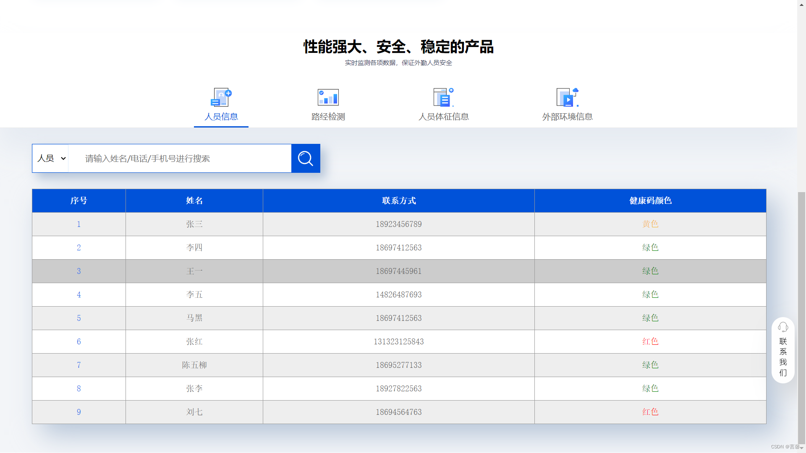
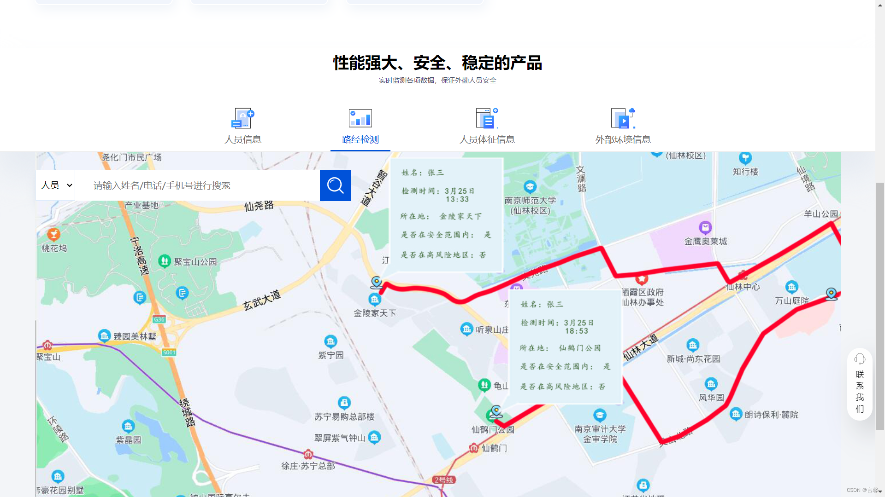
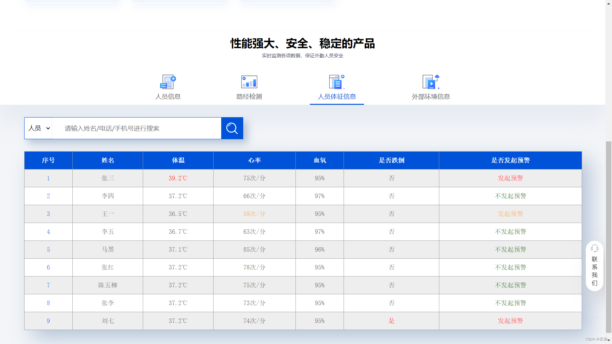
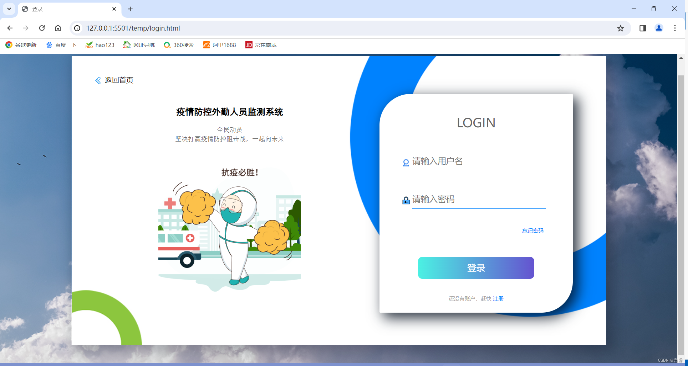

# SafetyBracelets（外勤人员监测系统）

## 项目背景

`SafetyBracelets` 是一个面向外勤/高风险岗位人员的前端展示项目，用于模拟“人员管理与安全监测”场景。

项目页面围绕以下目标展开：
- 对外勤人员基础信息进行统一展示；
- 对路径轨迹、人员体征、外部环境等关键指标进行可视化切换查看；
- 通过预警字段（如异常体温、异常环境参数）表达安全风险状态。

> 当前仓库版本以静态页面演示为主，数据为示例数据，便于后续对接真实后端接口或物联网采集数据。

---

## 技术栈

本项目采用轻量级静态前端技术实现：

- **HTML5**：页面结构与模块划分
- **CSS3**：页面布局、样式、状态颜色（正常/预警）与基础响应式适配
- **JavaScript（原生）**：交互逻辑（导航切换、内容面板显示隐藏等）

目录中还包含图片、字体、PSD 设计源文件等静态资源。

---

## 主要功能

### 1. 首页展示（`temp/index.html`）
- 顶部头图与导航区域；
- 人员分类入口（消防、缉毒、医护等）；
- 监测能力模块切换（人员信息 / 路径检测 / 人员体征 / 外部环境）。

### 2. 人员信息管理展示
- 列表展示人员姓名、联系方式、健康码状态；
- 通过颜色区分状态（绿色/黄色/红色）。

### 3. 路径检测展示
- 提供路径/地图展示区域（可扩展接入真实地图服务）。

### 4. 人员体征监测
- 展示体温、心率、血氧、跌倒状态、预警状态等指标；
- 突出显示异常项，便于快速识别风险人员。

### 5. 外部环境监测
- 展示温度、湿度、氧气浓度、有害气体浓度等数据；
- 支持异常状态高亮与预警提示。

### 6. 基础交互逻辑
- 通过 `static/js/index.js` 实现模块 Tab 切换；
- 点击不同监测项，切换对应内容面板。

---

## 页面效果图

### 首页


### 人员信息模块


### 路径检测模块


### 人员体征信息模块


### 登录页


---

## 项目结构

```text
SafetyBracelets/
├─ temp/
│  ├─ index.html          # 主页面
│  └─ login.html          # 登录页面
├─ static/
│  ├─ css/                # 样式文件
│  ├─ js/                 # 前端交互脚本
│  ├─ imgs/               # 图片资源
│  ├─ fonts/              # 字体资源
│  └─ psd/                # 设计源文件
└─ README.md
```

---

## 本地运行方式

本项目为纯静态页面，推荐使用本地静态服务器运行（避免直接双击打开导致资源路径问题）。

### 方式一：VS Code Live Server
1. 用 VS Code 打开项目目录；
2. 安装并启用 Live Server；
3. 右键 `temp/index.html` -> `Open with Live Server`。

### 方式二：Python 临时静态服务
在项目根目录执行：

```bash
python -m http.server 8080
```

然后访问：
`http://localhost:8080/SafetyBracelets/temp/index.html`

---

## 后续可扩展方向

- 对接后端 API，实现人员数据与监测数据实时更新；
- 接入地图 SDK（如高德/百度）实现真实轨迹回放；
- 引入图表库（ECharts）增强可视化能力；
- 增加权限控制、登录鉴权与操作日志；
- 支持移动端适配与组件化重构（如 Vue/React）。

---

## 说明

- 当前示例数据主要用于前端原型演示，不代表真实业务数据；
- 如用于生产环境，请补充数据校验、接口鉴权与安全策略。
